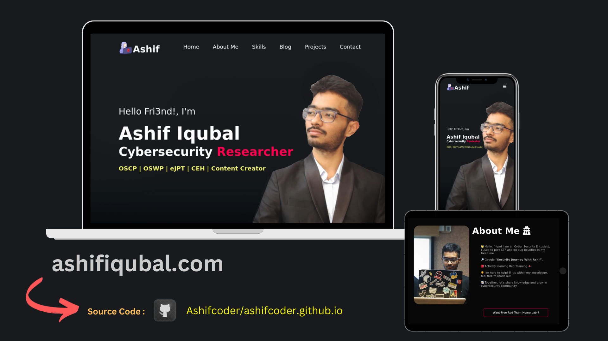

# Ashif’s portfolio page!

Welcome to my portfolio website repository! This is my first attempt at creating a portfolio website.



## About 👾

I embarked on this project with a desire to showcase my work and experiences, even though I'm not a professional web developer. It has been a fantastic learning experience, and I'm grateful for the opportunity to dive into the world of web development.

Check out my portfolio website here: https://ashifiqubal.com

## Features 

- Personalized portfolio showcasing my projects and skills. 
- Utilized CSS to enhance the visual appeal of the website.
- Open-source and free for exploration.

## Getting Started 🌱

To view the website locally, follow these steps:

- Clone the repository: 

```sh
git clone https://github.com/Ashifcoder/ashifcoder.github.io.git
```

```sh
cd ashifcoder.github.io/
```

- Open the `index.html` file in your preferred web browser.
- Explore the different sections on the website.


## Honourable Mentions 💫

Youtube Videos
- https://youtu.be/0YFrGy_mzjY
- https://youtu.be/nqowYS_cpns
- https://youtu.be/ETvRZgrcFj8

Amazing Websites
- https://fontawesome.com/
- https://www.flaticon.com/
- https://www.freepik.com
- https://www.pluralsight.com/guides/using-github-pages-with-custom-domain

Opensource Software 
- https://www.gimp.org/
